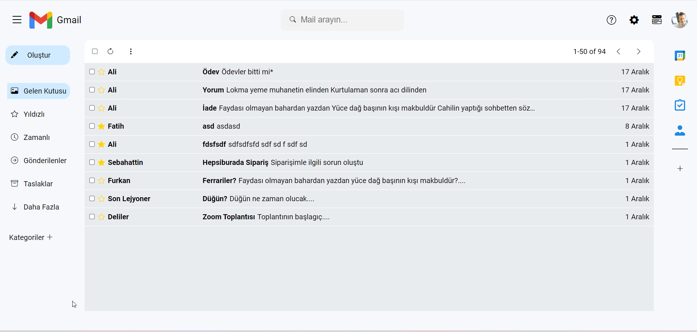

h1>GMail-CLONE-PROJECT</h1>

 The Gmail Clone project replicates the core functionalities of Gmail, offering users a familiar and functional email experience.
The Gmail Clone project is a web application aimed at replicating the core functionalities of Gmail, a popular email service by Google. 
Built using HTML5, CSS3, SCSS, and JavaScript, this project offers users a familiar interface with a range of essential email management features.

<h3>How to Use</h3>

1. Download or clone the project files.
2. Open the `index.html` file in a web browser to view the website.

<h3>Features</h3>

- A modern design created with advanced HTML 5, CSS.SCSS ve Js codes.
- Responsiveness.
- Enriched content with Google fonts and Boostrap icons.
If you have any questions or suggestions, feel free to contact me at [gkarakaya0601@gmail.com](mailto:email@example.com).

